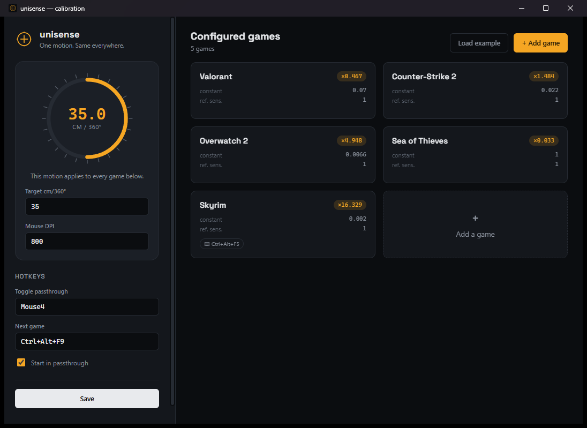
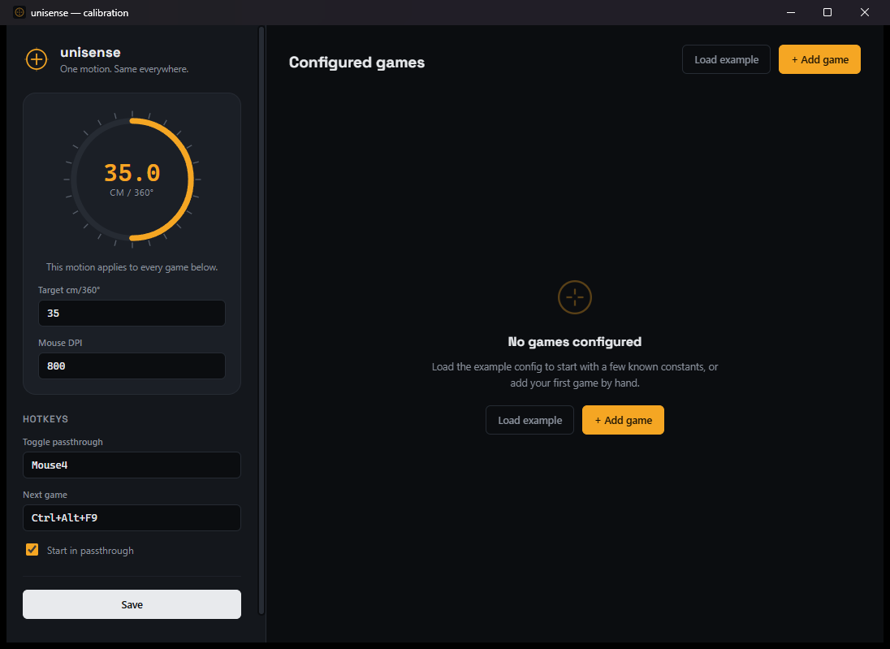
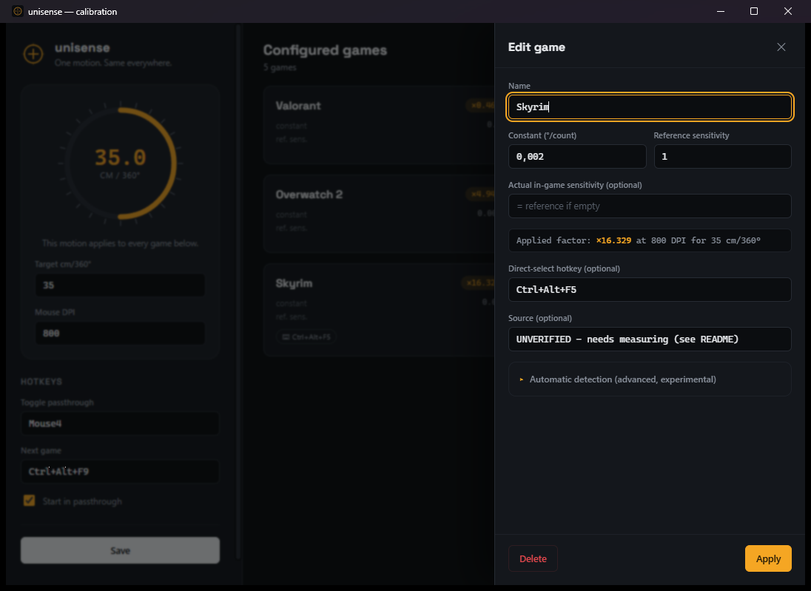

# unisense

Normalizes mouse aim sensitivity across games: you set **one universal
target** (cm of hand movement per 360°), and unisense computes and applies
the scaling factor that honors it in every configured game, regardless of
mouse DPI or that game's internal sensitivity scale.



## Project intent

There is no common standard between games for aim sensitivity: a "3" in one
game means nothing in another, and re-finding "your" sensitivity from one
game to the next is an error-prone manual chore. unisense is a **comfort and
accessibility** tool: it gives no advantage a player couldn't already get by
computing the right setting by hand (which sites like
mouse-sensitivity.com already let you do) — it just automates the
calculation and its application. No cheat functionality (aimbot, ESP,
recoil macros, etc.) is in scope for this project and never will be.

## ⚠️ Important warning: kernel-level anti-cheats

unisense relies on the **Interception** driver, a Windows kernel driver.
Many legitimate accessibility/comfort tools use it, but **some kernel-level
anti-cheats (Riot Vanguard for Valorant, some BattlEye/EAC modes) actively
detect and ban third-party input-interception drivers**, even with no
cheating intent, and can result in a ban. Before using unisense on a given
game:

- Check that game's anti-cheat policy regarding third-party input drivers /
  low-level remapping software.
- If in doubt, **don't use it** on that game, or test on a secondary account
  first.
- The authors of this project are not responsible for the consequences
  (bans, etc.) of using it on a game whose anti-cheat forbids it.

## How it works

1. A dedicated thread opens an **Interception** context and captures raw
   mouse HID reports, upstream of RawInput, Windows ballistics, and any
   desktop DPI-aware scaling.
2. For the active game, unisense knows a public constant
   (`deg_per_count_at_ref`, "camera rotation degrees per raw mouse count,
   measured at a documented reference in-game sensitivity").
3. From the declared hardware DPI, that constant, and your
   `target_cm_per_360` target, unisense computes a multiplicative factor.
4. That factor is applied to the raw X/Y deltas (simple linear
   multiplication, no acceleration curve added), then the modified deltas
   are re-injected via Interception, indistinguishable to the game from
   native mouse movement.
5. A hotkey (keyboard or mouse button) toggles between **passthrough**
   (factor 1.0, for menus/desktop) and **active game**. Game selection
   happens via the tray icon or a keyboard shortcut — no automatic process
   detection by default.

The full calculation is documented and tested in `core/src/scaling.rs`.

## Installation

Interception's user-mode DLL (`interception.dll`) and the kernel driver
installer are **bundled in this repo** under `vendor/interception/`
(unmodified official binaries, redistributed under LGPL 3.0 — see
`vendor/interception/NOTICE.md`): no need to go download them from GitHub
separately.

### 1. Interception driver (required, system-level step)

1. Open a command prompt **as administrator** in `vendor/interception/` and
   run:
   ```
   install-interception.exe /install
   ```
2. **Restart Windows** (the driver loads at boot; installing alone isn't
   enough).

To uninstall later: `install-interception.exe /uninstall`, then restart.

### 2. Build unisense

Prerequisites: [Rust](https://rustup.rs/) (edition 2021+), MSVC toolchain
(`rustup default stable-x86_64-pc-windows-msvc`). The repo is a 3-member
Cargo workspace: `core` (shared logic), `app` (the tray executable
described above), and `gui` (the configuration UI, see below).

```
cargo build --release -p unisense
```

`app/build.rs` automatically copies `vendor/interception/interception.dll`
next to the generated executable (`target/release/unisense.exe`) on every
build: nothing to do manually for that file. Just copy the exe, the DLL
next to it (already done by the build), and the `config/` folder wherever
you want to run it.

(`cargo build --release` without `-p` also builds the GUI — slower, and
requires the WebView2 runtime, present by default on Windows 11.)

> unisense generally needs to run **as administrator**: the Interception
> driver refuses `interception_create_context()` otherwise.

### 3. Configuration

Copy `config/games.example.yaml` to `config/games.yaml` (next to the
executable) and edit it:

```yaml
settings:
  mouse_dpi: 800              # current DPI set on your mouse
  target_cm_per_360: 35.0     # your universal target
  toggle_hotkey: "Mouse4"     # passthrough <-> last active game
  cycle_game_hotkey: "Ctrl+Alt+F9"
  start_in_passthrough: true

games:
  - name: "Valorant"
    deg_per_count_at_ref: 0.07
    reference_sensitivity: 1.0
```

`unisense.exe path\to\config.yaml` lets you override which config file is
used (handy for multiple profiles).

### 4. Set up the game

In the game's options, set its in-game sensitivity to exactly the
documented `reference_sensitivity` value (often `1.0`). unisense, not the
game, then does all the scaling work. If the game doesn't let you enter
that exact value (stepped slider), put the value actually used in
`current_sensitivity` (see comments in `config.rs` / the YAML) — **only
valid if the game's sensitivity formula is linear**, which is true for most
Source/Quake/Unreal/idTech engines but false for some games (Minecraft, for
instance, has a cubic curve).

## Configuration GUI (optional)

Hand-editing `games.yaml` works, but a second executable, `unisense-gui`,
provides an interface to do it without touching the YAML: add/remove
games, load the example config in one click, and an assistant for
`auto_detect` (5.2). It reads/writes the exact same `config/games.yaml` as
the tray app (next to its own executable — put both `.exe` files in the
same folder).

```
cargo build --release -p unisense-gui
```

`target/release/unisense-gui.exe` — no need to run it as administrator
(except to read the memory of a game whose anti-cheat requires it).



Features:

- Calibration gauge: cm/360° target and DPI, with a live-updating preview
  of the factor applied to each game in the list (`×0.xx` badge).
- Game cards: add, edit, delete; live factor preview while typing the
  constant.
- **Load example**: reloads the contents of `games.example.yaml` (embedded
  in the binary at compile time, no network access) as a starting point.
- **Automatic-detection assistant** (in a game's editor, collapsible
  section):
  - A process picker (lists running processes) and module picker, to fill
    in `process_name`/`module_name` without typing them by hand.
  - A "before/after" mini memory scanner: you capture a snapshot of the
    game's memory in one state (e.g. menu), a second one in the other state
    (e.g. in-game), and the tool lists the bytes that changed between the
    two — a "Use" button on a candidate fills in `offset`/`in_game_bytes`
    directly. Read-only (`ReadProcessMemory`), capped in scanned volume
    (~96 MB of readable/writable private regions): it's a Cheat-Engine-style
    "first pass" scan, not a full reverse-engineering tool — refine by
    repeating the operation if too many candidates come back.



## Hotkeys

Accepted formats in the YAML: `"F9"`, `"Ctrl+Alt+F9"`, `"Shift+F5"`,
`"Mouse3"` (middle click), `"Mouse4"` (back button), `"Mouse5"` (forward
button). Keyboard hotkeys go through the standard Windows API
(`RegisterHotKey`, global, work even with a game in the foreground); mouse
hotkeys are detected directly in the Interception stream (mouse buttons
aren't supported by `RegisterHotKey`).

- `settings.toggle_hotkey`: toggles passthrough <-> last used game.
- `settings.cycle_game_hotkey`: moves to the next game in the list (leaves
  passthrough if needed).
- `hotkey:` (optional, per game): selects that game directly.
- Left-click on the tray icon: same as `toggle_hotkey`.
- Right-click on the tray icon: menu (pick a game, passthrough, quit).

## Computing a new game's constant

`deg_per_count_at_ref` = number of degrees the camera turns for **a single
count** of raw mouse movement, with in-game sensitivity fixed at
`reference_sensitivity`.

**Method 1 — public table**: look up the game on
[mouse-sensitivity.com](https://www.mouse-sensitivity.com/) or in the
game's config files (e.g. `m_yaw` for Source/GoldSrc engines, often `0.022`
by default — the constant is then
`reference_sensitivity * m_yaw`).

**Method 2 — empirical measurement** (reliable, independent of third-party
tables):

1. Set a known DPI D (e.g. 800) and the in-game sensitivity to your
   reference (e.g. 1.0).
2. In the game, turn the camera by exactly 360° using a mouse pad with a
   marker (or a ruler plus a visual reference point on screen), and measure
   the distance traveled in cm: `measured_cm_360`.
3. Compute:
   ```
   deg_per_count_at_ref = (2.54 * 360) / (measured_cm_360 * D)
   ```
   (this is the inverse of the formula used by `scaling::compute_factor`,
   see the comments at the top of `core/src/scaling.rs`).
4. Add the entry to `games.yaml` with `reference_sensitivity` = the value
   used in step 1.

Re-validate the constant after any major game update that touches
sensitivity (watch the patch notes).

## Automatic detection (advanced, experimental)

Item 5.2 of the spec (automatic menu/gameplay toggling via memory reading)
is implemented as a **generic framework**, not as pre-filled offsets for
specific games: this project doesn't ship or maintain any memory address,
since they're specific to each game version and break on the next patch.

To enable it for a game, add an `auto_detect` block to its entry (see the
commented example in `games.example.yaml`):

```yaml
auto_detect:
  process_name: "MyGame.exe"
  module_name: "MyGame.exe"   # optional, defaults to the main module
  offset: 0x00ABCDEF          # offset from the module base
  pointer_chain: []           # pointer chain to follow, if needed
  in_game_bytes: [0x01]       # expected value WHILE PLAYING (gameplay)
  poll_interval_ms: 250
```

Finding `offset`/`in_game_bytes` requires reverse-engineering the game
(e.g. [Cheat Engine](https://www.cheatengine.org/), scanning for "01
in-game / 00 in menu", then "which static pointer leads there"). This is
done read-only (`ReadProcessMemory`); unisense never writes into another
process's memory. See also the anti-cheat warning above: reading the memory
of a process protected by a kernel anti-cheat can also be
detected/forbidden independently of Interception.

## Code architecture

Three-member Cargo workspace:

```
core/                       unisense-core (lib, no Win32 dependency)
  src/config.rs              YAML schema + loading/saving
  src/scaling.rs              Factor calculation + accumulator (tested)

app/                        unisense (the tray executable, described above)
  build.rs                   Copies vendor/interception/interception.dll
  src/interception.rs         FFI bindings to interception.dll
  src/hotkey.rs                Parses "Ctrl+Alt+F9" / "Mouse4"
  src/capture.rs                Capture thread (scaling + mouse hotkeys)
  src/state.rs                   Shared state (mode, factors, accumulators)
  src/tray.rs                     Invisible Win32 window, tray, hotkeys
  src/memory_watch.rs              Auto-detection (5.2), generic framework
  src/main.rs                       Wires everything above together

gui/                        unisense-gui (configuration UI)
  src-tauri/build.rs          tauri_build::build()
  src-tauri/src/sysinfo.rs     Process/module/memory scan (Win32)
  src-tauri/src/commands.rs     Commands exposed to the frontend
  src-tauri/src/main.rs          Tauri wiring
  frontend/                       Static HTML/CSS/JS (no bundler)
```

`core` is shared between `app` and `gui` so the factor calculation and the
config schema stay a single source of truth.

Only a single linear factor is applied (`x' = x * F`, `y' = y * F`): no
acceleration curve, smoothing, or capping added by the tool itself, as
required.

## Known limitations

- Windows/Interception can't read the mouse's hardware DPI: `mouse_dpi`
  must be kept up to date by hand in the config if you change it on the
  mouse.
- The `current_sensitivity`/`reference_sensitivity` correction assumes a
  linear sensitivity formula on the game's side; false for a few games
  (non-linear curves), see above.
- `deg_per_count_at_ref` can become stale after a game update.
- No automatic process detection for switching games by default (a
  deliberate choice per the spec); can be combined with `auto_detect` (5.2)
  if you're willing to maintain your own offsets.

## Ideas for improvement

- **Foreground-process detection** (`GetForegroundWindow` + matching the
  exe name to a configured game) as a more reliable, less fragile
  alternative to memory reading for at least knowing *which game* is
  active (the menu/gameplay distinction would remain manual or via
  `auto_detect`).
- **Hot-reloading** the YAML (file watcher) without restarting the tray
  app.
- **On-screen indicator** (discreet overlay) of the active mode, for those
  who don't watch the notification area.
- **Multiple mice**: the code already keeps accumulators per
  `InterceptionDevice`, but there's no way yet to configure a different DPI
  per physical mouse.
- **Installer** (MSI or a guided install script for the driver + the app +
  creating a startup task).
- **Local API (named pipe)** to drive game/mode switching from a Stream
  Deck, an AutoHotkey script, or a third-party game launcher.
- **Pointer chain in the GUI**: `pointer_chain` (useful for addresses that
  move on every game launch) is only editable by hand in the YAML for now,
  not from the detection assistant.
- **Native file picker** in the GUI to choose a `games.yaml` somewhere
  other than the conventional folder next to the exe (currently no
  dependency on a Tauri dialog plugin, to stay minimal).

## Contributing / versioning

The version number and `CHANGELOG.md` are managed automatically by
[release-please](https://github.com/googleapis/release-please) from commit
messages on `main`, in
[Conventional Commits](https://www.conventionalcommits.org/) format:

- `feat: ...` -> minor version bump
- `fix: ...` -> patch version bump
- `feat!: ...` / `BREAKING CHANGE: ...` footer -> major version bump
- `chore:`, `ci:`, `docs:`, `test:`, `build:`, `refactor:`, `perf:` -> no
  version bump (but a changelog entry for `docs`/`perf`/`refactor`)

On every release, `.github/workflows/publish-release-assets.yml` builds and
attaches a zip (`unisense.exe` + `interception.dll` + `unisense-gui.exe` +
`config/` + `vendor/`) to the GitHub Release. See `CLAUDE.md` for the
pipeline's details.

## License

MIT, see `LICENSE`, for unisense's own source code (`core/`, `app/`,
`gui/src-tauri/`, `gui/frontend/*.{html,css,js}`).

Redistributed third-party components (unmodified binaries, separate
licenses — see each NOTICE):
- `vendor/interception/`: Interception (LGPL 3.0, non-commercial use — see
  `vendor/interception/NOTICE.md`).
- `gui/frontend/fonts/`: Space Grotesk (SIL OFL 1.1 — see
  `gui/frontend/fonts/NOTICE.md`).
